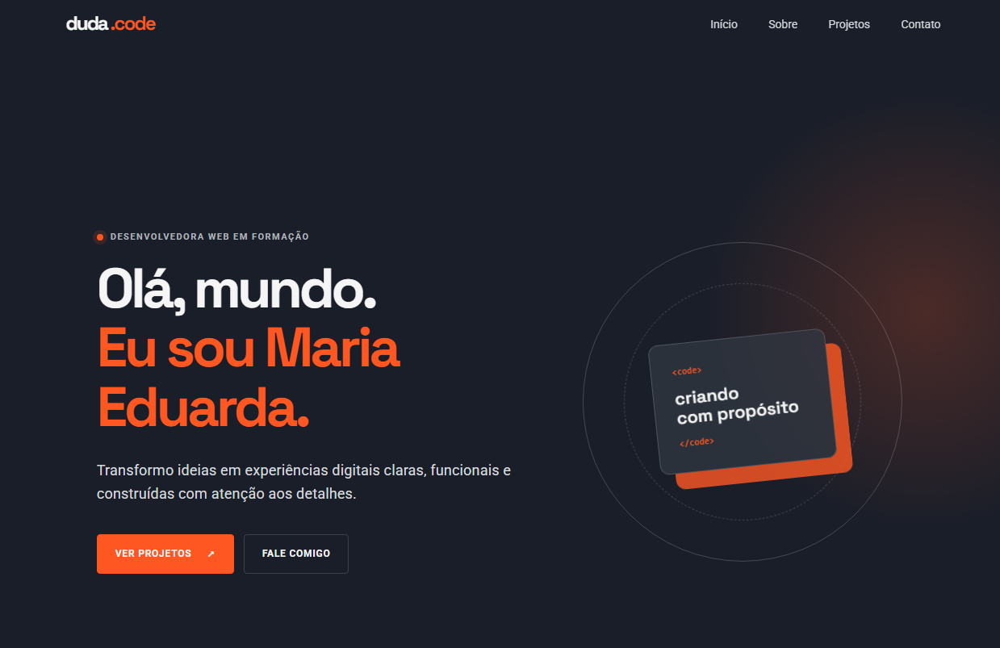

# ✨ Portfólio — Maria Eduarda Pereira

Meu portfólio pessoal, criado para reunir os projetos que venho desenvolvendo e contar um pouco sobre a minha caminhada na área de tecnologia.

🌐 **[Acesse o site aqui](https://meu-portfolio-programa-duda.vercel.app/)**



---

## 👩🏻‍💻 Sobre o projeto

Esta é uma página única e responsiva. Nela apresento minha formação, os conhecimentos que estou desenvolvendo, projetos selecionados e as formas de entrar em contato comigo.

Quis manter o visual escuro do projeto original e usar o laranja como ponto de destaque. Também adicionei pequenos movimentos e estados de interação para a página parecer mais viva, sem deixar a navegação pesada.

---

## 🛠️ Tecnologias utilizadas

- **HTML5** — estrutura e conteúdo da página
- **CSS3** — estilo, responsividade e animações
- **JavaScript** — menu mobile e interações da interface
- **Google Fonts** — fontes Roboto e Space Grotesk
- **Vercel** — deploy do projeto

---

## ✨ O que o site tem

- Menu com navegação por seções
- Layout ajustado para desktop, tablet e celular
- Seção de apresentação, habilidades, projetos e contato
- Links para currículo, GitHub, LinkedIn, WhatsApp e Instagram
- Animações suaves ao navegar pela página
- Respeito à preferência de reduzir movimentos do sistema

---

## 📁 Organização dos arquivos

```text
Meu_Portfolio/
├── imagens/       # imagens usadas no portfólio
├── index.html     # estrutura da página
├── style.css      # estilos, animações e responsividade
├── script.js      # menu e interações
└── README.md      # informações do projeto
```

---

## 🚀 Como visualizar localmente

Não é necessário instalar nada.

1. Clone este repositório:

   ```bash
   git clone https://github.com/Programa-Duda/Meu_Portfolio.git
   ```

2. Acesse a pasta criada:

   ```bash
   cd Meu_Portfolio
   ```

3. Abra o arquivo `index.html` no navegador.

Se usar o VS Code, a extensão **Live Server** deixa esse processo mais prático.

---

## 📌 Próximas melhorias

- [ ] Adicionar projetos novos com demonstração e repositório
- [ ] Criar uma versão em inglês
- [ ] Adicionar uma pequena explicação em cada projeto
- [ ] Desenvolver uma nova imagem para o início

---

## 📬 Contato

- [LinkedIn](https://www.linkedin.com/in/maria-eduarda-pereira-a6b005344/)
- [GitHub](https://github.com/Programa-Duda)
- [E-mail](mailto:dudapereira.dev@gmail.com)
- [WhatsApp](https://wa.me/5519991881910)
- [Instagram](https://www.instagram.com/duda.code/)

---

Feito com ☕ por [Maria Eduarda Pereira](https://github.com/Programa-Duda).
